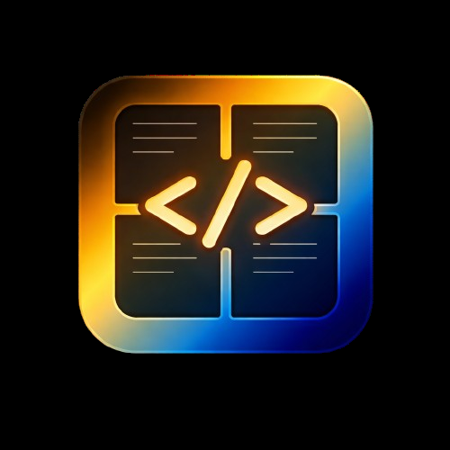

# FinkSpace

Multi-agent terminal workspace manager built with Tauri, React, and xterm.js. Run multiple Claude Code instances, shells, and terminals side-by-side in a single window with workspaces, resizable panes, and a built-in Kanban board.



## Features

### Terminal Workspaces
- **Multiple workspaces** with color-coded tabs — each workspace holds its own set of terminal panes
- **Open Folder** per workspace — right-click a tab to set the working directory; all new terminals in that workspace start there
- **Flexible pane layouts** — choose from 13 preset layouts (2+3, 3x3, etc.) or let auto-layout handle it
- **Resizable panes** — drag borders between terminal panels to resize
- **Drag & drop reordering** — rearrange terminal panes by dragging their headers

### Supported Terminals
- Claude Code (AI coding agent)
- Windows PowerShell / Command Prompt / Git Bash / WSL
- macOS: Zsh, Bash, Fish
- Linux: Bash, Zsh, Fish
- System Default (auto-detect)

### Kanban Board
- Persistent board with drag & drop cards and columns
- Card details: description, labels, priority levels, due dates, checklists with progress tracking
- Search and filter by title, label, or priority

### Settings
- **Appearance** — dark, light, and black themes with customizable accent color
- **Terminal** — default shell selection, pane layout presets, font, cursor, scrollback
- **Shortcuts** — fully configurable keyboard shortcuts
- **AI Agents** — default agent type, working directory, Claude CLI flags
- **API Keys** — manage Anthropic API key

### Keyboard Shortcuts

| Action | Shortcut |
|---|---|
| New workspace | `Ctrl+T` |
| Close workspace | `Ctrl+Shift+W` |
| Switch workspace 1-9 | `Ctrl+1` - `Ctrl+9` |
| New terminal pane | `Ctrl+N` |
| Close pane | `Ctrl+W` |
| Next/previous pane | `Ctrl+]` / `Ctrl+[` |
| Toggle settings | `Ctrl+,` |
| Terminal view | `Ctrl+1` |
| Kanban view | `Ctrl+2` |

On macOS, `Cmd` is used instead of `Ctrl`.

## Tech Stack

- **Tauri 2** — native desktop app with Rust backend for PTY management
- **React 19** + TypeScript — frontend UI
- **xterm.js** — terminal emulation with WebGL rendering
- **Zustand** — state management with localStorage persistence
- **Tailwind CSS** — styling
- **@dnd-kit** — drag & drop for terminal pane reordering
- **react-resizable-panels** — resizable pane borders
- **portable-pty** (Rust) — cross-platform pseudo-terminal spawning

## Getting Started

### Prerequisites

- [Node.js](https://nodejs.org/) (v18+)
- [Rust](https://rustup.rs/) (latest stable)
- [Tauri CLI prerequisites](https://v2.tauri.app/start/prerequisites/) for your platform

### Development

```bash
# Install dependencies
npm install

# Run in development mode
npm run tauri dev
```

### Build

```bash
# Build for production
npm run tauri build
```

The built application will be in `src-tauri/target/release/`.

## Project Structure

```
src/                    # React frontend
  components/           # UI components
    kanban/             # Kanban board sub-components
    settings/           # Settings panel sections
  hooks/                # Custom React hooks
  stores/               # Zustand state stores
  types/                # TypeScript type definitions
  lib/                  # Utilities (Tauri bridge, colors, platform)

src-tauri/              # Tauri/Rust backend
  src/
    commands/           # Tauri IPC command handlers
    pty.rs              # PTY process management
    state.rs            # App state
```

## License

MIT
